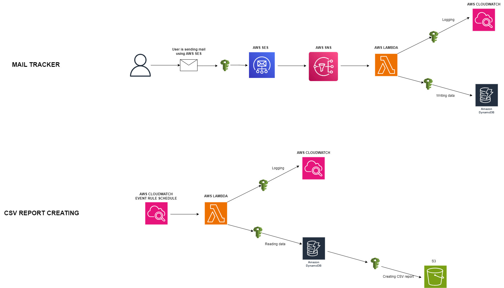

# **STRUCTURE**

**Used AWS Services**

* Lambda
* S3
* SES
* SNS
* Cloudwatch
* IAM
* DYNAMODB
* KMS

**Used Technologies**

* Terraform
* Powershell Scripting
* Python
* AWS CLI

**Explanations of Used Services**

1. **LAMBDA**
    * Lambda functions are used for **getting emails metadata from SES/SNS and writing to DynamoDb** and **creating CSV reports for last week.**
    * We have two different Lambda functions with below names
        1. **mail-tracker-lambda-function**
            * This Lambda function is created by **Terraform**. Lambda function name can be changed in Terraform variables in **trackers.tfvars** file.
            * This Lambda function is written with **Python 3.11**
            * This Lambda function is getting data from **SNS Service** and writing in the **DynamoDb table.**
            * **SNS** is configured as a **Lambda trigger**
            * There is one Environment variable as **TABLE_NAME** for the **DynamoDb**. This value is coming from **Terraform**. You can change this one in **trackers.tfvars**
            * Lambda is sending the execution logs to **Cloudwatch**. We can check the lambda results in the **Cloudwatch**.
        2. **csv-report-lambda-function**
            * This Lambda function is created by Terraform. Lambda function name can be changed by Terraform variables in **trackers.tfvars** file
            * This lambda function is written with **Python 3.11**
            * This function is getting data from **DynamoDb** and **creating the CSV report** **for last week**. This CSV report is sent to **S3 bucket.**
            * **Cloudwatch Event rule** created for this Lambda function and rule configured to execute this lambda function **every monday**.
            * There are two Environment variables as **TABLE_NAME** and **S3_BUCKET_NAME** for the **DynamoDb** and **S3 bucket**. This value is coming from **Terraform**. You can change this one in **trackers.tfvars**
            * Lambda is sending the execution logs to **Cloudwatch**. We can check the lambda results in the **Cloudwatch**

2. **S3**
    * **S3** is used for **storing the terraform state buckets** and to **storing CSV reports of Emails metadata.**
    * We have two different S3 buckets with below names
        1. **tracker-terraform-state-bucket**
            * I created this one manually before executing the terraform scripts
            * Terraform states are stored in this bucket.
        2. **csv-report-s3-bucket**
            * This S3 bucket is created by Terraform. Name can be changed by Terraform variables in **trackers.tfvars** file
            * CSV Reports of the Emails metadata are stored in this bucket. Lambda function is sending the CSV Reports to this S3 bucket every week. Lambda is accessed by using IAM roles and policies.
3. **SES**
    * This service is used to send **SMTP mail **by user** using the credentials**.
    * This credential is created by **Terraform **under **IAM user **.These credentials can be obtained from the** S3 state bucket**.
    * **Configuration set** created and** Event destination** created for sending these metadata to **SNS**
    * **Verified Identity** created for my email and configuration set attached to this identity. This email can be changed in terraform **trackers.tfvars**
    * After terraform created verified Identity, related email users need to verify the email using the sent email manually.

4. **SNS**
    * **SNS** is getting email metadata from **SES** and sending this **metadata to Lambda**.
    * SNS topic created by Terraform. Name can change in **trackers.tfvars**
    * SNS Subscription created by Terraform. Added Lambda function to this subscription. So SNS is sending email metadata to the lambda function.

5. **CloudWatch**
    * **Cloudwatch** is used for **monitoring the Lambda logs **and **scheduling the CSV report Lambda Function.**
    * **Lambda functions** accessing Cloudwatch **using the IAM roles and policies**.
    * Terraform created the **Cloudwatch Event Rule** for **CSV Report Lambda Function.** This function will **execute every monday at 07:00 AM UTC by CloudWatch Event Rule.**

6. **IAM**
    * **IAM **is used for** SMTP credentials** and **grant access between services using policies and roles**.
    * Terraform created the **IAM user and Security Credentials (Access and Secret keys)**.
    * Lambda is accessing **Dynamodb**, **Cloudwatch** and **S3 **using the** IAM roles** and **policies**.

7. **DYNAMODB**
    * **DynamoDb** is created by **terraform** and used for **storing email metadata.**
    * One lambda function is **writing email metadata** to **DynamoDb** table and the other lambda function is **reading this table and creating the CSV report**.

8. **KMS**
    * **KMS** is used for **encrypting the terraform state S3 bucket**.
    * **Server-side encryption with AWS Key Management Service keys (SSE-KMS**) id is written **in terraform**

9. **AWS CLI**
    * AWS Cli is used for authenticating to AWS environment

10. **Powershell**
    * Powershell is used for testion to send SMTP using the AWS SES.

11. **Python**
    * Python 3.11  used in the Lambda Functions.

12. **Terraform**
    * Terraform used for provisioning the all AWS environment.

**LOCALSTACK**

I used my own AWS account to implement the solution. If we need to use localstack instead of the real AWS environment we need to use the below terraform provider.

    provider "aws" {

    region  = "us-east-1"

    endpoint = "http://localhost:4566"  # LocalStack endpoint

    skip_credentials_validation = true

    skip_metadata_api_check = true

    }

Before using terraform you need to use some AWS CLI commands to authenticate your localstack environment using the profiles.

**SECURITY / BEST PRACTICES**

**S3**

* Terraform state bucket encrypted with **Server-side encryption with AWS Key Management Service keys (SSE-KMS)**
* For CSV report S3 bucket, by default **encryption using Server-side encryption with Amazon S3 managed keys (SSE-S3)** enabled
* Public Access blocked for all s3 buckets
* Bucket versioning enabled for terraform s3 state bucket

**LAMBDA**

* Lambda is accessing **Dynamodb**, **Cloudwatch** and **S3 **using the** IAM roles** and **policies**.

**SES**

* User is sending email using the **SMTP credentials**. This credential can only send email access.
* SMTP credentials created by terraform but I didn't add these credentials as terraform output. Because this is sensitive data. User needs to get these credentials from the **S3 state bucket**.

**SNS**

* SNS topics can be encrypted (I didn't encrypt it.)

**Cloudwatch**

* Lambda functions is **accessing Cloudwatch** **using the IAM roles** **and policies**.

**IAM**

* Console Access disabled for created users.
* Only related permission granted for the SMTP user
* Only related permission granted for the IAM policies.

**DYNAMODB**

* For billing mode used **PAY_PER_REQUEST** instead of **Provisioned capacity**
* Encryption is Managed by DynamoDB.
* Lambda is accessing **Dynamodb **using the** IAM roles** and **policies**.

**STEPS**

* I installed the AWS CLI manually to my computer.

        msiexec.exe /i https://awscli.amazonaws.com/AWSCLIV2.msi

* I installed the terraform manually to my computer.
* I created AWS secret key and access key for my AWS user in the AWS Security Credential.
* I created the AWS S3 bucket to store terraform state manually
* Executed the below terraform commands to create my environment in AWS.

**TERRAFORM COMMANDS**

Create

        .\terraform init

        .\terraform plan -out trackers.tfplan -var-file="trackers.tfvars"

        .\terraform apply trackers.tfplan

Destroy

        .\terraform plan -destroy -out trackers.tfplan -var-file="trackers.tfvars"

        .\terraform apply trackers.tfplan

**After Executed terraform commands**

* Email identity needs to be verified by the user manually by sent email (**AWS is sending email to user to verify**).

* You can get the SMTP credentials from the S3 bucket terraform state and write in the related lines in below script

* For testing to send email and get metadata via Lambda, You can execute the below script.

        powershell.exe .\send_test_email.ps1

**RESOURCES**

[https://github.com/hashicorp/terraform/issues/10748](https://github.com/hashicorp/terraform/issues/10748)

[https://github.com/hashicorp/terraform-provider-aws/issues/26927](https://github.com/hashicorp/terraform-provider-aws/issues/26927)

[https://registry.terraform.io/providers/-/aws/latest/docs](https://registry.terraform.io/providers/-/aws/latest/docs)
